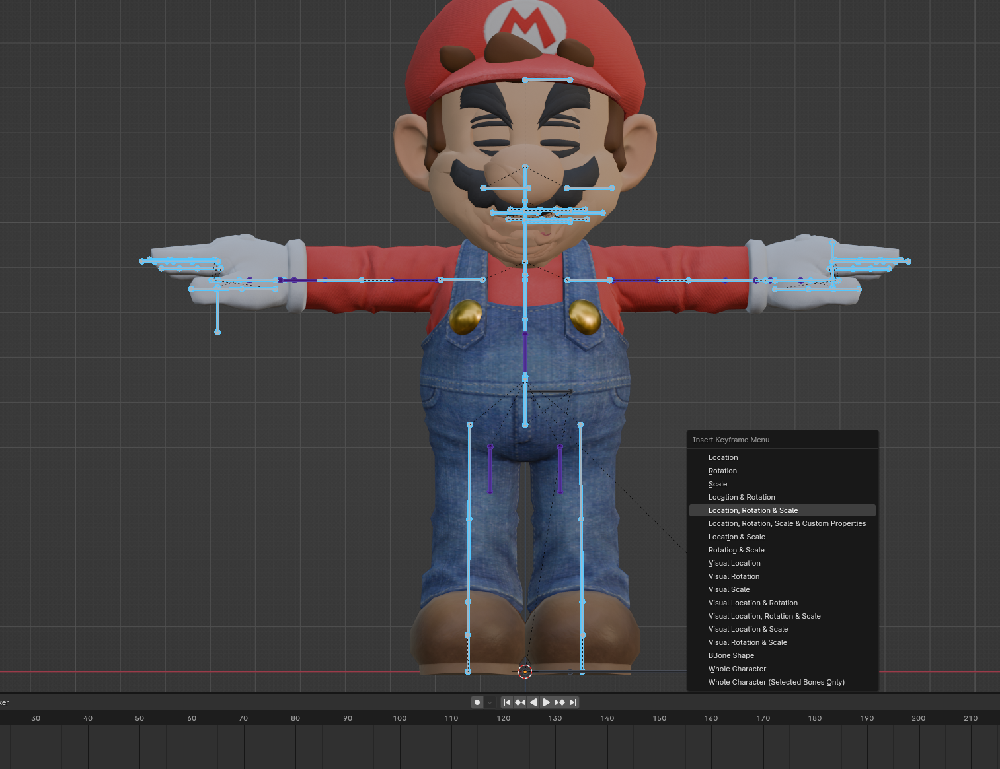

# Wi-Fi Safe Animation Maker

This readme will serve as a guide for how to use these sets of scripts. Please note this is only for *ADVANCED* mod makers. You should have ample knowledge on smash ultimate animations and Wi-Fi safing mods before even attempting to use these scripts. Without further ado, let's get into it...

## Overview
These scripts are used for the automation of Wi-Fi safe character animations. For an example on what this entails, please look at the following mods which utilize a Wi-Fi Safe skeleton:
* [Shantae](https://gamebanana.com/mods/470017) by [me]( https://gamebanana.com/members/1549492), Animations by [SushiiZ]( https://gamebanana.com/members/1523557)
* [SF5 Animation Pack for Ken]( https://gamebanana.com/mods/449351) by [SushiiZ]( https://gamebanana.com/members/1523557)
* [Smash Bros 64 Mario Fsmash]( https://gamebanana.com/mods/466235) by [SushiiZ]( https://gamebanana.com/members/1523557)

### What is a Wi-Fi Safe Skeleton?
This tech is relatively new, so I don’t blame you if you aren’t aware of it. A Wi-Fi Safe Skeleton is very similar to an Exo-Skeleton (If you don’t know what this is, these scripts are far too advanced for you).

The difference between a Traditional Exo-Skeleton and a Wi-Fi-Safe Skeleton is an Exo skeleton is comprised of helper bones that only copy the values of standard bones, while a Wi-Fi Safe Skeleton is comprised of Standard bones, meaning they can be manually animated and still be Wi-Fi safe.

This technique was pioneered by [SushiiZ]( https://gamebanana.com/members/1523557) and he intends to make a more in-depth tutorial in the future. When completed I will link to it in this overview.

### Why Make these Scripts?
Previous iterations of this technique would have the Wi-Fi-safe Skeleton’s meshes only activated when the new Wi-Fi Safe animation was playing, and once it was finished, it would swap back to meshes parented to the Vanilla Skeleton. 

However, this method introduced several edge cases where the game will act erratically, and visually displeasing.

Most of this has to do with how the game handles animation interpolation and vis meshes swapping via code. Several examples of these states are:
* Items/States that give unique facial expressions
  * Joker’s Curse state
  * Super Spicy Curry
* Certain Command Grabs
  * Ridley’s side special
  * Ganondorf’s side special
  * Captain Falcon’s up special
  * etc.
* Certain animations that play from idle
  * item pickup
  * runbreak
  * crouch
  * etc.

The visual errors range from the character’s expressions not lining up with their face mesh, and T-posing for a few frames. This can mostly be corrected via a custom plugin but will still have the visual error for one frame due to how smash handles animation frame interpolation.

I wanted to remove these interpolation errors entirely and to do so, you must simply never swap between the Vanilla Skeleton Meshes and the Wi-Fi-Safe Skeleton Meshes. In order to do this though, you must retarget your Wi-Fi safe skeleton to vanilla for every animation for your character. This would take hours, so I created these scripts to automate the process.

## Functionality
These scripts will take an input of vanilla `NUANMB` animation files, decode them to `JSON` via [SSBH_data_json]( https://github.com/ultimate-research/ssbh_lib) add duplicate entries for every Wi-Fi safe skeleton bone, reencode to `NUANMB` and splice with [Carlos’s Wi-Fi Safe Animation Splicer]( https://github.com/ssbucarlos/wifisafe_anim_splicer) to ensure Wi-Fi safety.

### Paths and Files

#### IN_JSON/
Folder where decoded `NUANMB`s will be placed.

#### IN_NUANMB/
Folder where you place vanilla `NUANMB`s.

#### OUT_JSON/
Folder where retargeted animations will be placed.

#### OUT_NUANMB/
Folder where encoded retargeted `NUANMB`s will be placed.

#### OUT_SPLICED/
Folder where spliced `NUANMB` will be placed.

#### SSBH_Path.txt
Path to where your ssbh_data_json.exe is, example provided is my personal path.

#### Added_vis.txt
Text file that contains all the new Vis meshes you will be adding to the animation that is not derived from vanilla meshes. Contains 2 entries per line separated by a space:
`<VIS_MESH_NAME> <Default State>
Default State has two options, 0 (turned off by default) and 1 (turned on by default)
Included example shows proper syntax.

#### batchDecomp.py
Takes files from IN_NUANMB/ and decodes them into `JSON`, Resulting `JSON` files will be placed in IN_JSON/

#### batchRecomp.py
Takes files from OUT_JSON/ and encodes them into `NUANMB`, Resulting files will be placed in OUT_NUANMB/

#### bone_dictionary.txt
Text document that contains a list of vanilla bones and what the duplicate entry should be named if encountered. 
Contains 2 entries separated by a space:
`<VANILLA_BONE_NAME> <WIFI_SAFE_BONE_NAME>
I recommend keeping the `_w` suffix schema as it is what SushiiZ, and I use and will have better compatibility for utilities/mods down the line.

#### settings.txt
Text file that contains all the options for the main script.
Each line represents a separate setting, the setting and value are separated by a space, equals sign, and a second space. **SYNTAX MATTERS!**

Settings are:
* vis_prefix
  * What the duplicate vanilla vis mesh entries will have appended to the front.
I recommend keeping the `w_` prefix schema as it is what SushiiZ, and I use and will have better compatibility for utilities/mods down the line.

* exo_fix
  * For use with skeletons with different proportions than the original, has 2 values: 0 (off) and 1 (on)
When on, the splicer will reference an animation to get the offset between 2 bones. This will deactivate translation keyframes e.g., Palutena’s Staff on forward tilt.

* reference_animation
  * If exo_fix is on, this animation will be referenced for bone positions. 
How to make this file:
Enter smash ultimate blender, import your character with a Wi-Fi safe skeleton. Add a keyframe for every bone in its default position. Export this file and decode it using `SSBH_data_json`. Place this file in the same location as the other scripts. I have included a reference for example of what the file will look like.
I will create a video tutorial for this later, so no worries if you don’t understand. 

*  exo_anchor_bone
   * If exo_fix is on, the selected bone will be used as an anchor point for the retarget.
What this means is it will be used as the position from where other bone locations are calculated.
Effectively this will “parent” the bone location similar to how exo bones are parented at the hip.

* skip_vis
  * If on will skip over changing any of the vis information. It will stay vanilla.
  
* use_prefix
  * If on an added prefix will be added to every vis mesh (useful for wifi safe animation swaps)

#### spliceanimation.bat
Batch file that must be edited to include the full path to Carlos’s Wi-Fi safe animation splicer. Used as a shortcut to make splicing animations easier after they are retargeted.

#### theworks.bat
Batch file that runs every script one after the other. Will effectively splice all the `NUANMB`s in the IN_NUANMB/ folder and deposit the fully Wi-Fi safe edits in the OUT_SPLICED/ folder.

#### wifisafeanimmaker.py
Main script that adds the retargeted duplicate entries

#### internalBoneRetargeter.py (EXPERIMENTAL)
Script derived from the previous one. Will take a reference animation and retarget all animaitons in IN_JSON/ to use the ref skeleton. Does not use any of the settings besides reference animation. Retargeted entries will go in OUT_JSON/ after completion, batch_recomp.py can be ran to get the output nuanmb's

## Ref Animation Guide
To use the ref animation you must first import you smash skeleton and export a nuanmb via smash ultimate blender with everything in a resting state.

#### make_folders.bat
makes the folder structures needed to use the scripts by default

Export with the following settings. Default reference name is ref.nuanmb I reccomend keeping that for simplicity's sake

Decompile it via ssbh_data_json.exe. Drag and drop your reference animation onto the exe to make ref.nuanmb.json

## Requirements:
* [SSBH_data_json]( https://github.com/ultimate-research/ssbh_lib) 
* [Carlos’s Animation Splicer]( https://github.com/ssbucarlos/wifisafe_anim_splicer)
* Python 3.0 or later
* Windows (for batch scripts)

## Parting Words
I don’t foresee many people using these, but I thought I’d publicize them regardless for those who want to attempt Wi-Fi Safe Skeletons. 

I also will be releasing a companion mod to this script which will serve to fix all the global grabbed animations that have the same interpolation issues when not patched. For this reason. I really recommend keeping the naming Schema invented by SushiiZ and continued by me. 

Like always if there are any issues please file a report, I will try to fix it but, its not my highest priority since the script works for me. If you have any questions, please wait for my short tutorial coming at some point, if that doesn't answer your question, feel free to reach out me on my socials

Have fun with the scripts! I hope you create cool stuff with these, for example, here is Sonic's run animation retargeted for Mario!

